# Squire App 🔮

Squire is a no-code web application used to create recommendation APIs 👨🏽‍💻 By attaching and labelling .xlsx files, users can create recommendation APIs for their frontend in minutes 🚀

**Try the Squire App** [here](https://www.notion.so/Business-Plan-for-an-Online-Web-Scraper-9047e8d453534ec5a826b2d56656a4a5?pvs=21)

---

## Video Demo

Watch how squire works:

[https://youtu.be/CkLlfM9NKd4](https://youtu.be/CkLlfM9NKd4)

---

## Tech Stack 🍱

### Front-end

- React Typescript (Front-end Framework) 🥷🏻
- Tailwind CSS (Styling) 💨
- Mantine UI (Design System Library) 🏊🏻

### **Back-end**

- Firebase (Authentication, Firestore, Serverless Functions, Hosting) 🔥
- Supabase (Vector Embedding Store) ❇️
- Python Flask (Recommendation API) 🐍
- Docker 🐋
- Google Cloud Run (API Hosting) ☁️

---

## How Recommendations Work

Recommendations are created when two documents are similar. For example, “i really like pasta” and “top-10 pasta dishes” would be similar documents since they both mention the word “pasta”. In order for a computer to query that quickly we will have to use a vector embedding function. Simply put, the vector embedding function converts a set of texts into a vector space.

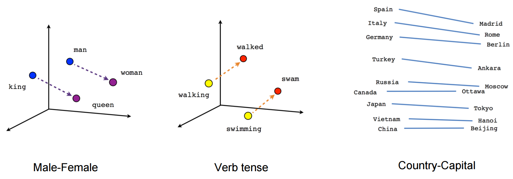

Words being placed onto a 3D vector to be compared

For this project we will be using OpenAI’s `text-embedding-ada-002` embedding function, but many other embedding functions like word2vec exists. We will be creating the embedding via their [API](https://platform.openai.com/docs/guides/embeddings).

### Cosine Similarity

For us to push recommendations to our user, we need to compare different set of texts to find out which are most similar to our user’s query text. We use the cosine similarity rule which compares how “close” two vector coordinates are to each other.


On each build, new vector embeddings are created to be queried. Recommendations are given to the user by finding which text are similar to the input document or query.

---

## Software Architecture

.jpg>)

### Going Serverless

In order to create recommendations fast, the most straight forward way to create vector embeddings will be do so in **parallel** - this means creating embeddings at the same time on request.

A serverless architecture is the most straight forward architecture especially with Firebase’s integration of Firestore & Cloud Functions. With Cloud Functions, embeddings can be created in on a Firestore document creation (this is a watcher function that is triggered).

Parallelism is achieved by splitting the rows of datas into uniformed chunks and creating multiple documents for each build. In the backend, Firebase spins up multiple instances of `onChunkCreated` function to handle with the multiple document creations. See diagram below:

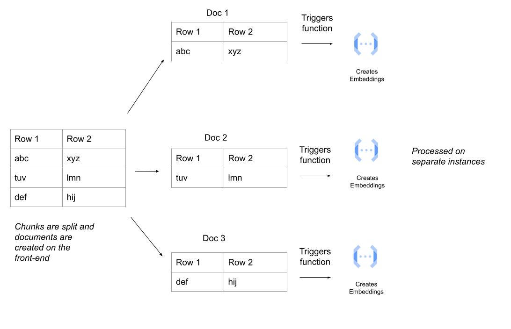

Once embeddings are created, they are stored in Supabase through pgvector extension. Embeddings are matched and queried from Supabase as well.

### Database Choice

We used Firebase, non-relational database, mainly due to its easy integration with Firebase Cloud Functions. We ensured data integrity by enforcing data types on the front-end using typescript. We also used Firebase for its realtime features that allowed for a dynamic user experience on the front-end, especially for the **“Chat with your Data”** feature.

---

## About this Repository 🏛️

The Squire Github repository uses a monorepo-style. This is to allow for easy collaboration and a single source of truth in project management. The repository consists of two main directories `squire-frontend` & `squire-backend`.

---

## Continuous Deployment 🏃🏻

There are two main parts to deploy for the Squire App: **`squire-frontend`** & **`squire-backend`.**

### Deploying Front-end 🖼️

In order for the React App to be hosted two main steps are required:

- Building React App
- Pushing to hosting

For this, we will be using **Github Actions** to build the React App, and deploy it to Firebase Hosting. This build process can be seen in `./github/workflows/deploy-prod.yml` or below:

```yaml
name: Deploy to Production
on:
  push:
    branches:
      - main
jobs:
  deploy_live_website:
    runs-on: ubuntu-latest
    steps:
      - uses: actions/checkout@v2
      - run: cd squire-frontend && npm ci && npm run build
      - uses: FirebaseExtended/action-hosting-deploy@v0
        with:
          entryPoint: ./squire-frontend
          repoToken: "${{ secrets.GITHUB_TOKEN }}"
          firebaseServiceAccount: "${{ secrets.FIREBASE_SERVICE_ACCOUNT }}"
          projectId: squire-backend-5c68c
          channelId: live
```

### Deploying Back-end ⚙️

In order for the Python Flask recommendation API to be hosted, we need to build a docker image and push to Google Cloud Run. We did this by setting up a Cloud Build Trigger via this [documentation](https://cloud.google.com/run/docs/continuous-deployment-with-cloud-build)

### On Push 👊🏻

Both deployments happen when pushed to `main` branch. Although not implemented for much of the progress of this project, the current CD setup allows for GitOps where pull request can be reviewed and **deployed on merge**.

---

## How to Use

### 1. Login/Sign Up

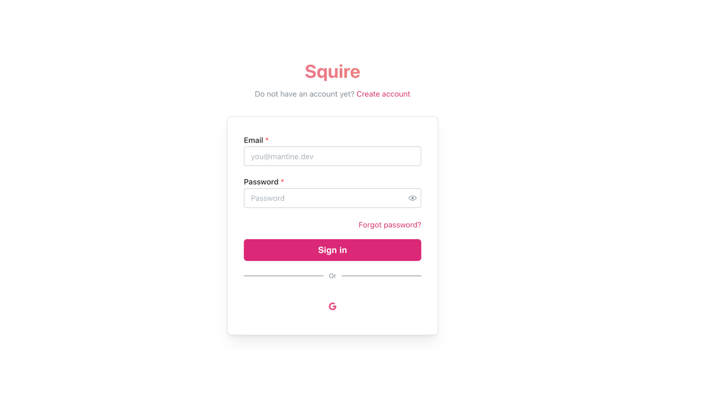

### 2. Creating a Project

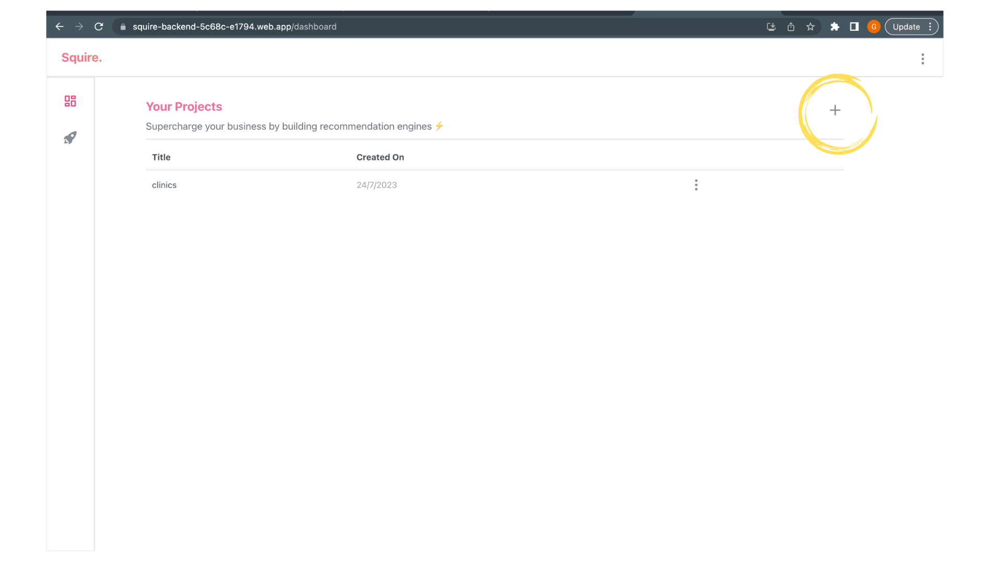

create a new project by clicking the ‘+’ sign

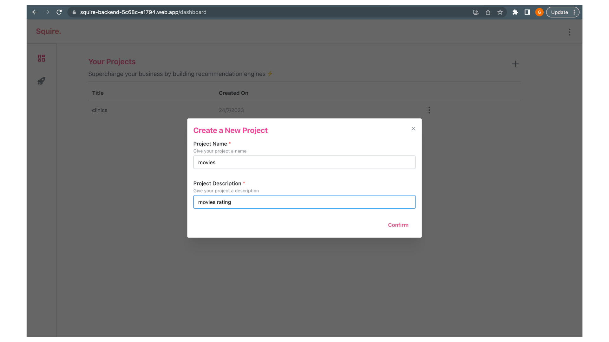

give a project name and project description

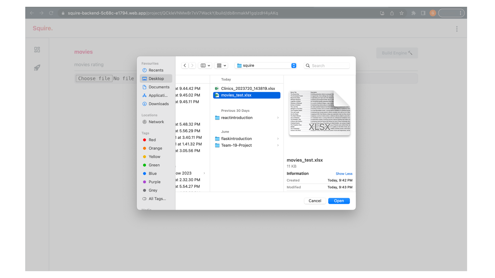

upload your excel file containing data

### 3. Creating a Build

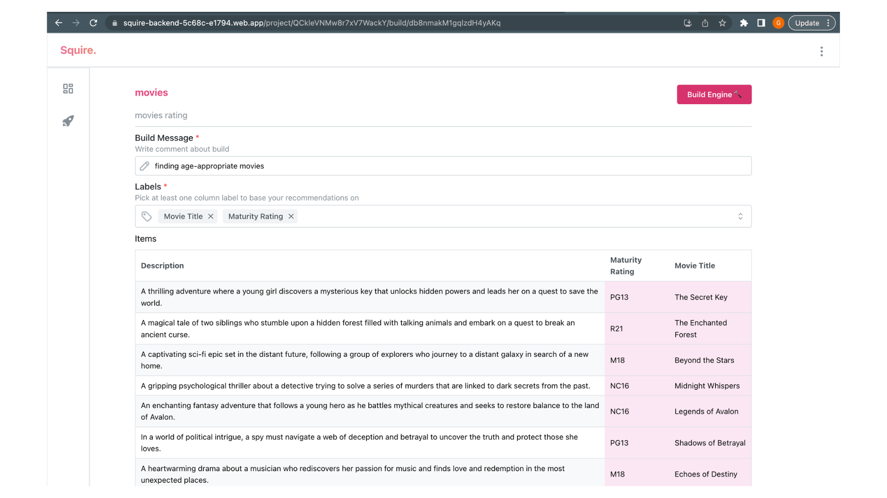

give a build message, followed by labelling the data desired

### 4. Querying

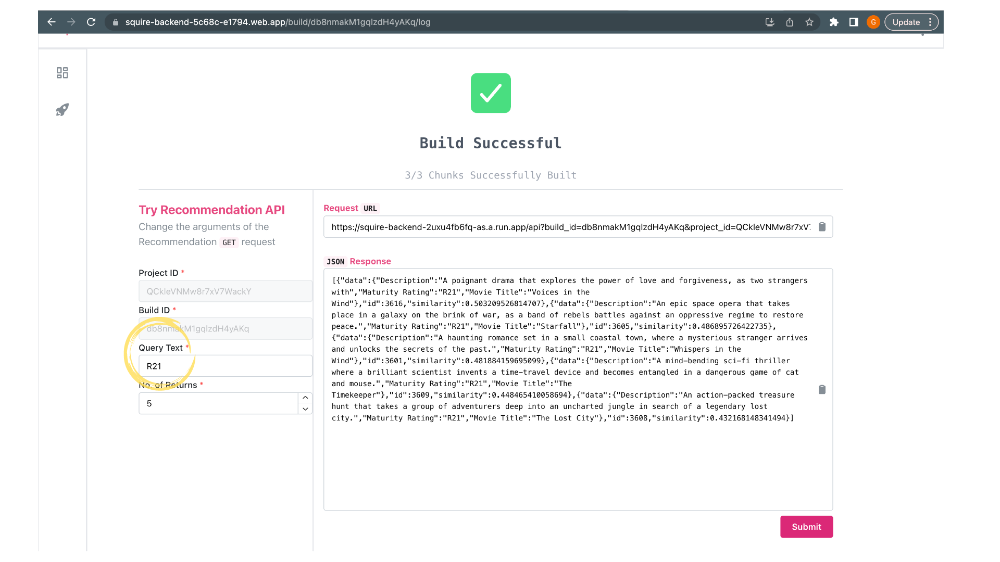

use the query text field to search through your data, and click submit

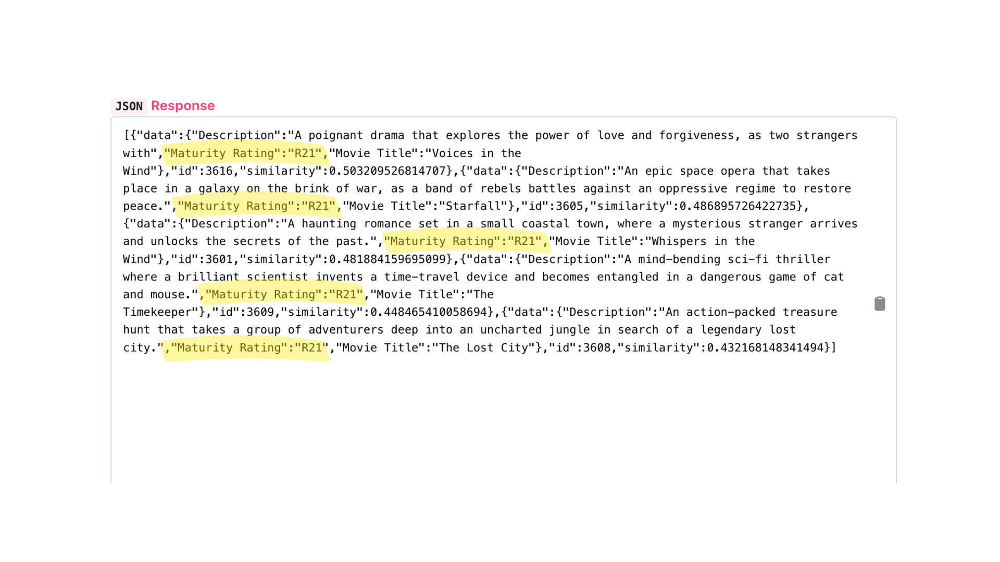

response returned will match the query text, with a similarity rating displayed as well

### 5. Chatting with your Data

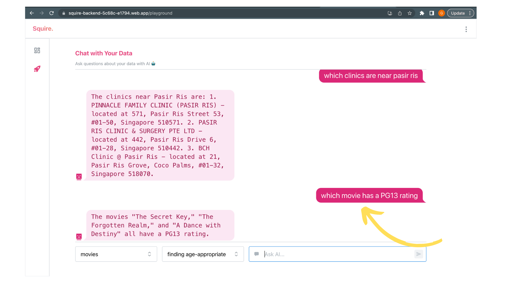

chatting with your data allows you to ask questions

### Creating Multiple Builds

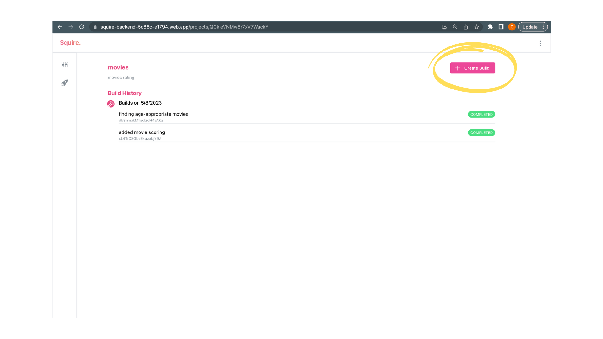

a new build can be created under the same project, whenever new data has been added

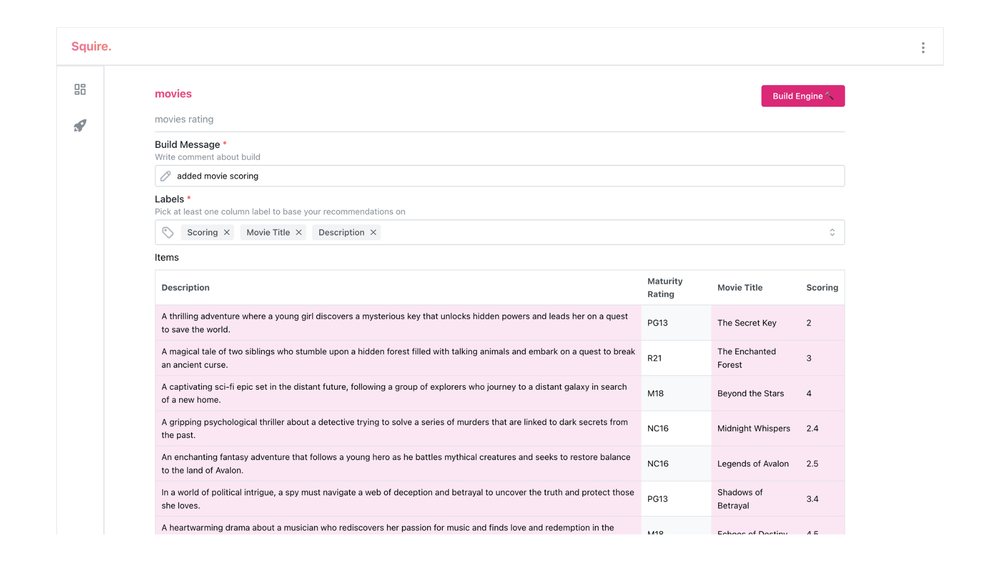

give a build message and label the data

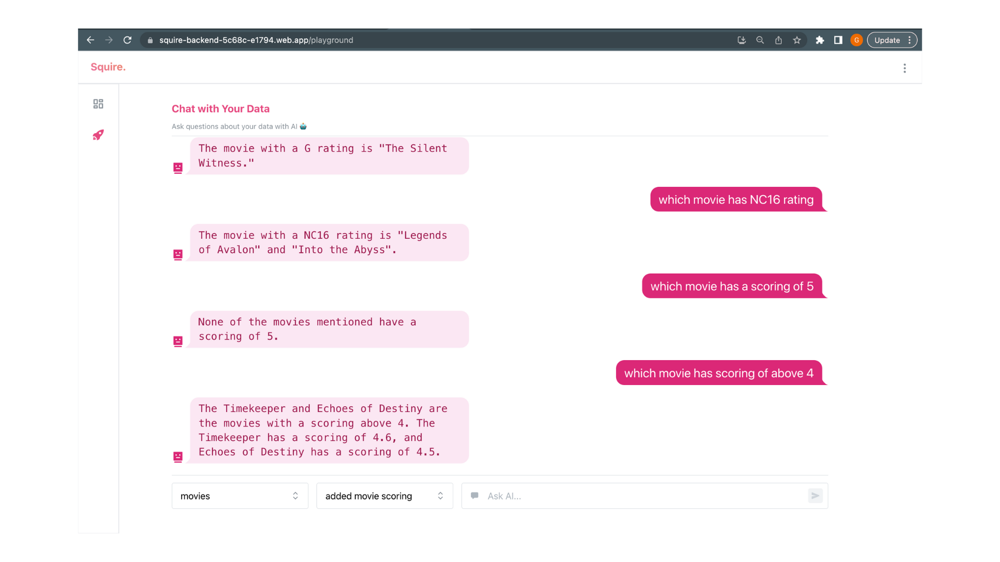

based on the specified project and build, ask away!
